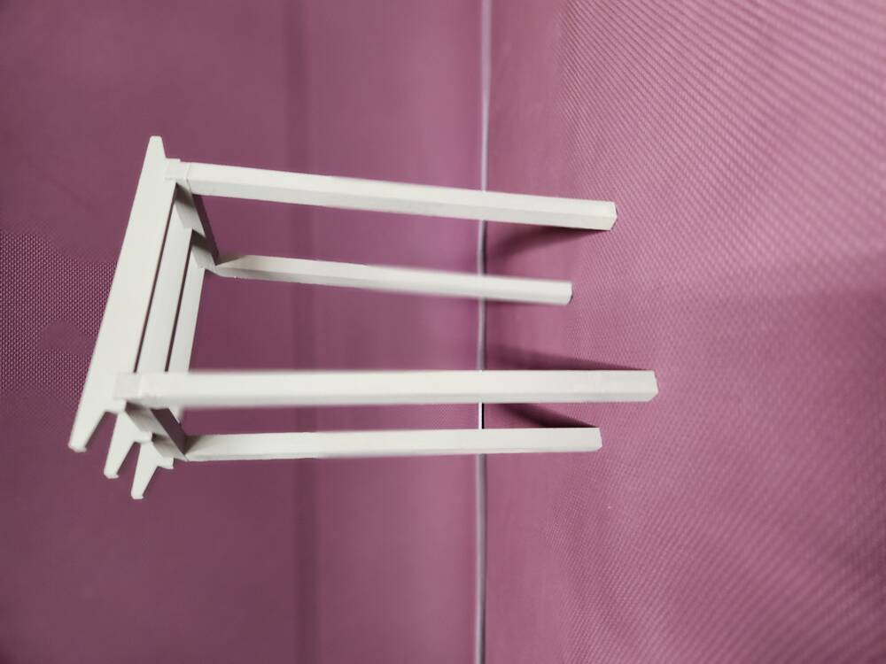
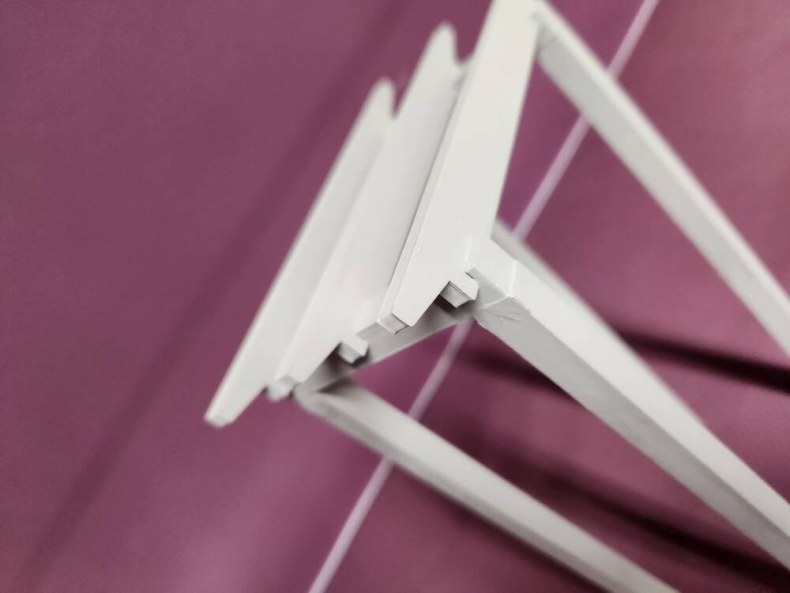
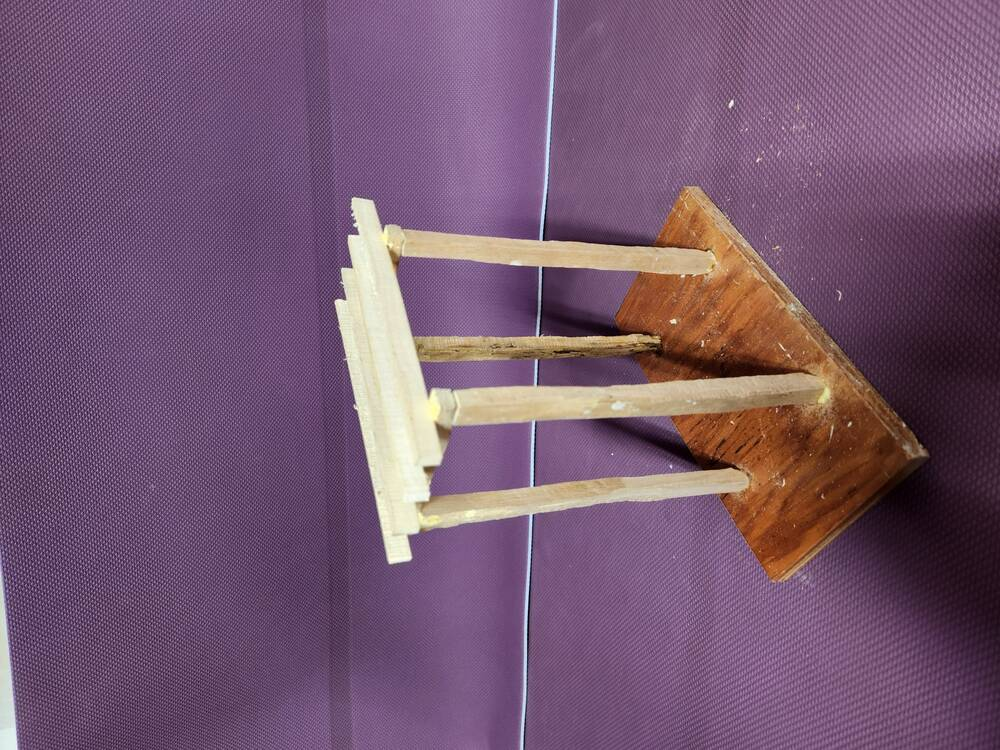
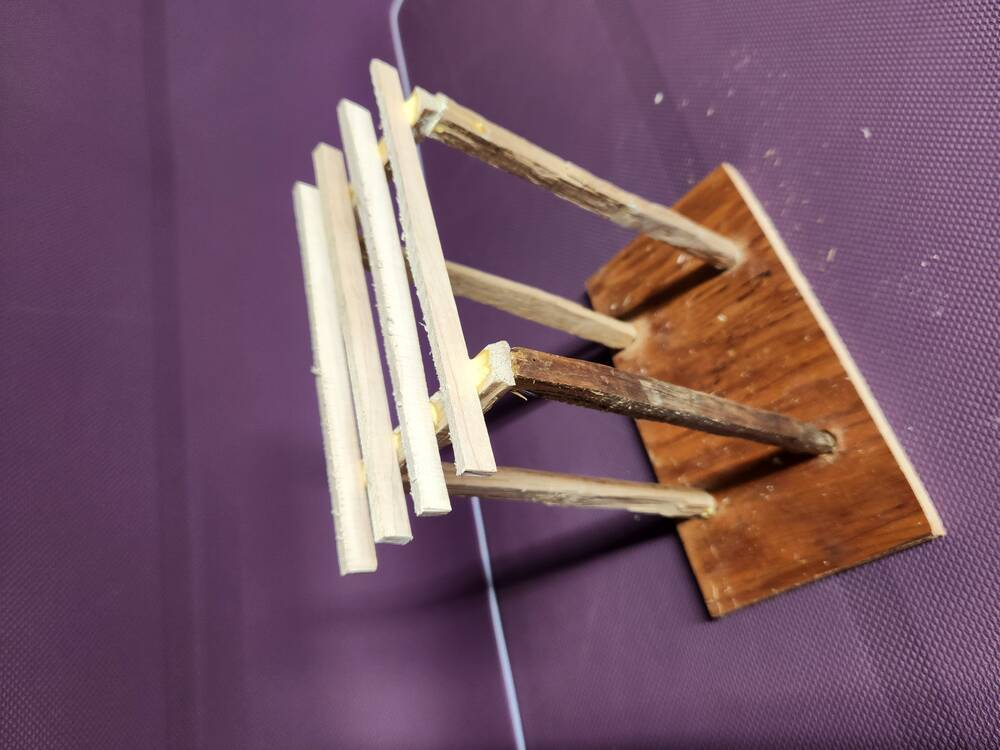
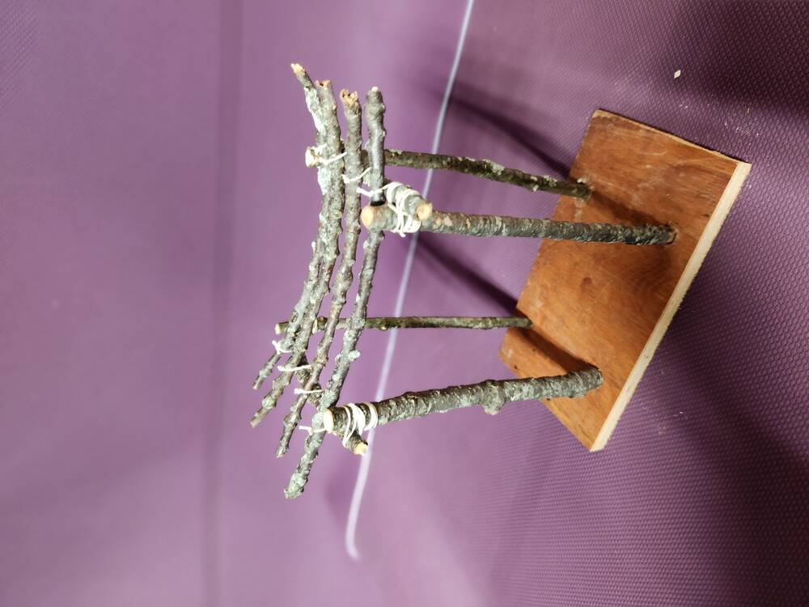
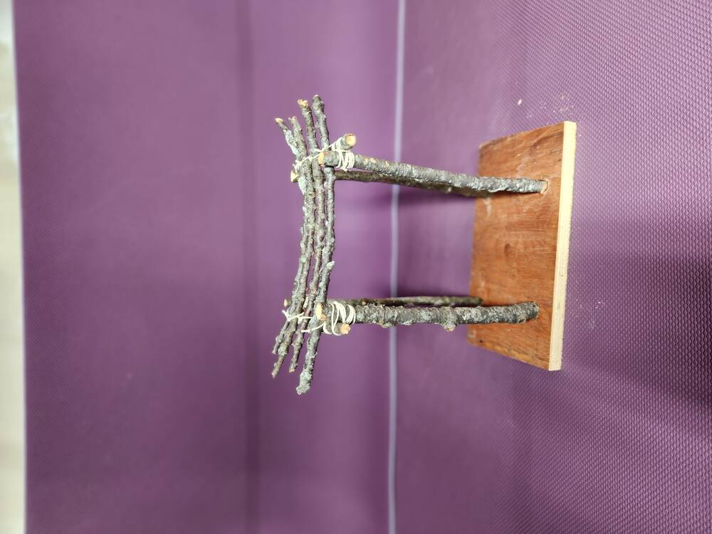

Wedding Arbors!

Below, built with dimensioned lumber.  4x4's and 2x6's.  

<figure>

</figure>

Below, thinking about using recycled beams of about the same dimension, but not as regular.

<figure>

</figure>

This is what is might look like to use parts of trees.

<figure>

</figure>

